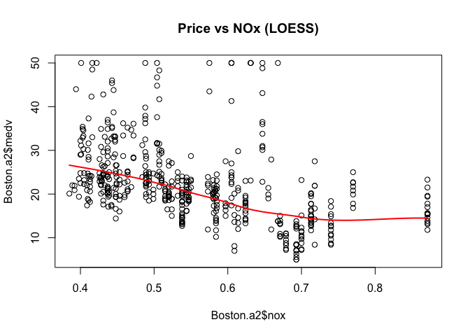
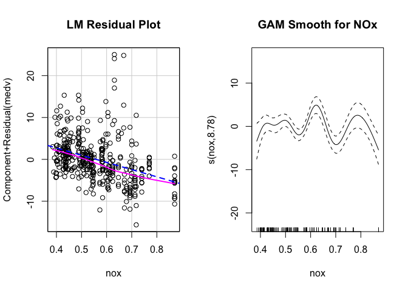

Boston Housing Model Comparison
================

#### Introduction

Comparison of models performance and interpretability, utilising the
boston housing dataset

#### Setup + Packages

``` r
# Ensure images go to your images folder
knitr::opts_chunk$set(fig.path = "images/boston/", warning = FALSE, message = FALSE)
library(mgcv)
library(car)
```

#### Data Preparation

Split into train and test sets

``` r
Boston.a2 <- read.csv("data/Boston_A2.csv", header=TRUE)
set.seed(3821)
train <- sample(506, 400)
Boston.train <- Boston.a2[train,]
Boston.valid <- Boston.a2[-train,]
```

#### Data Visualisation

A look at the relationship between NOx and house price (non - linearity)

``` r
par(mfrow=c(1,1))
plot(Boston.a2$nox, Boston.a2$medv, main="Price vs NOx (LOESS)")
lines(loess.smooth(Boston.a2$nox, Boston.a2$medv), col = "red", lwd = 2)
```

<!-- -->

#### Fitting Models

``` r
# Fit models
mod.lm <- lm(medv ~ ., data=Boston.train)
mod.gam <- gam(medv ~ s(crim)+s(zn)+s(indus)+s(nox)+s(rm)+s(age)+s(dis)+s(tax)+s(ptratio)+s(lstat), data=Boston.train)
mod.ppr <- ppr(medv ~ ., data=Boston.train, nterms=2, max.terms=7)

# Diagnostic Plots
par(mfrow=c(1,2))
crPlot(mod.lm, variable = "nox", main="LM Residual Plot")
plot(mod.gam, select=4, main="GAM Smooth for NOx")
```

<!-- -->

#### Model Performance Comparison

``` r
rmse.lm  <- sqrt(mean((Boston.valid$medv - predict(mod.lm, newdata = Boston.valid))^2))
rmse.gam <- sqrt(mean((Boston.valid$medv - predict(mod.gam, newdata = Boston.valid))^2))
rmse.ppr <- sqrt(mean((Boston.valid$medv - predict(mod.ppr, newdata = Boston.valid))^2))

# Display as a table
data.frame(
  Model = c("Linear Model", "GAM", "PPR"),
  RMSE = c(rmse.lm, rmse.gam, rmse.ppr)
)
```

    ##          Model     RMSE
    ## 1 Linear Model 3.991413
    ## 2          GAM 2.580609
    ## 3          PPR 2.482907

Tradeoff between model explainability and performance.
