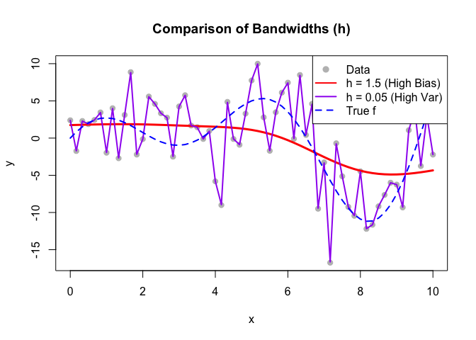
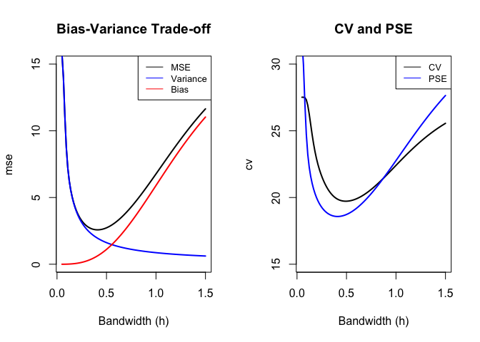

Non Parametric Regression
================

#### Introduction

This analysis explores kernel smoothing, and the effect of the bandwidth
on various statistical measures

#### Setup + Packages

``` r
knitr::opts_chunk$set(fig.path = "images/")
library(mgcv)
library(car)
```

#### Kernel Smoothing

Define a custom function to calculate the kernel smoother matrix S

``` r
kernel_smoother<-function(x,h){
  n<-length(x)
  S<-matrix(0,nrow=n,ncol=n)
  for(i in 1:n){
    S[i,]<-dnorm((x-x[i])/h)/sum(dnorm((x-x[i])/h))
  }
  return(S)
}

h=1
n=61
x<-seq(from=0, to=10, length.out=n)
S<-kernel_smoother(x,h)

f<-(5-x)*sin(x)+x*cos(5-x)

sigma2=16
h<-seq(0.05,1.5, length.out=100)
avg_bias<-rep(0,length(h))
avg_variance<-rep(0,length(h))
mse<-rep(0,length(h))
pse = mse
cv = rep(0, length(h))

set.seed(3821)
y<-f+rnorm(n,sd=4)

for(i in 1:length(h)){
  S<-kernel_smoother(x,h[i])
  b=f - S %*% f
  avg_bias[i]<- t(b) %*% b /n
  avg_variance[i]<-sum(diag((S %*% t(S))))*sigma2/n
  mse[i]<-avg_bias[i] + avg_variance[i]
  pse[i] = sigma2 + mse[i]
  fhat = S %*% y
  cv[i] = mean(((y - fhat)/(1-diag(S)))^2)
}

print('Done!')
```

    ## [1] "Done!"

#### Data Visualisation

Quick graph showing the generator function, random points and a smoothed
output

``` r
S_high <- kernel_smoother(x, 1.5)
fhat_high <- S_high %*% y

S_low <- kernel_smoother(x, 0.05)
fhat_low <- S_low %*% y

plot(x, y, col = "gray", pch = 19, main = "Comparison of Bandwidths (h)")
lines(x, fhat_high, col = "red", lwd = 3)      # Smooth fit
lines(x, fhat_low, col = "purple", lwd = 2)    # Wiggly fit
lines(x, f, col = "blue", lwd = 2, lty = 2)    # True function

legend("topright",
       legend = c("Data", "h = 1.5 (High Bias)", "h = 0.05 (High Var)", "True f"),
       col = c("gray", "red", "purple", "blue"),
       pch = c(19, NA, NA, NA),
       lty = c(NA, 1, 1, 2),
       lwd = 2,
       cex = 0.8)
```

<!-- -->

#### Bias - Variance Trade Off

Illustrate the bias - variance tradeoff

``` r
par(mfrow=c(1,2))

# Plot 1: MSE Components
plot(h,mse,col='black',type='l',lwd=2,ylim=c(0,15), xlab="Bandwidth (h)")
lines(h,avg_variance, col='blue',lwd=2)
lines(h,avg_bias, col='red',lwd=2)
title('Bias-Variance Trade-off')
legend("topright", legend = c('MSE', 'Variance', 'Bias'),
       lty = 1, col = c('black', 'blue', 'red'), cex=0.8)

# Plot 2: Selection Criteria
plot(h, cv, col='black', type='l', lwd=2, ylim=c(15,30), xlab="Bandwidth (h)")
lines(h, pse, col='blue',lwd=2)
title('CV and PSE')
legend("topright", legend = c('CV', 'PSE'), lty = 1, col = c('black', 'blue'), cex=0.8)
```

<!-- -->
