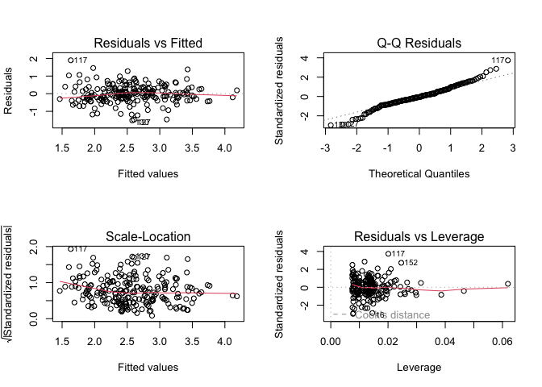

Longevity Analysis
================

#### Introduction

This analysis explores the relationship between a species’ maximum age,
its body mass, and its class using a multiple linear regression
framework.

#### Setup

``` r
knitr::opts_chunk$set(fig.path = "images/longevity_new/", warning = FALSE, message = FALSE)
data <- read.csv("data/longevity_data.csv", header = TRUE)
head(data)
```

    ##                       Species Class Body_mass_g Maximum_age_yrs
    ## 1         Red-shouldered hawk  Aves       658.0            22.4
    ## 2 Black-chested buzzard-eagle  Aves      2860.0            42.0
    ## 3                Common swift  Aves        44.9            21.1
    ## 4        Calliope hummingbird  Aves         3.0             7.0
    ## 5                  Brown kiwi  Aves      2380.0            35.0
    ## 6                Herring gull  Aves      1000.0            49.0

#### Data Visualisations

Analysing potential for log transforms. Intuition that log can be useful
for features that have more multiplicative scaling, such as weight

``` r
par(mfrow = c(2, 2))
plot(data$Body_mass_g, data$Maximum_age_yrs)
plot(log(data$Body_mass_g), data$Maximum_age_yrs)
plot(data$Body_mass_g, log(data$Maximum_age_yrs))
plot(log(data$Body_mass_g), log(data$Maximum_age_yrs))
```

<!-- -->

log log transform appears to be the most effective.

#### Model Fitting

Fitting a log - log model with indicator variables

``` r
# Fit the linear model with log transformations
fit.lm <- lm(log(Maximum_age_yrs) ~ log(Body_mass_g)*Class, data = data)
summary(fit.lm)
```

    ## 
    ## Call:
    ## lm(formula = log(Maximum_age_yrs) ~ log(Body_mass_g) * Class, 
    ##     data = data)
    ## 
    ## Residuals:
    ##      Min       1Q   Median       3Q      Max 
    ## -1.51170 -0.27692 -0.02852  0.27617  1.89030 
    ## 
    ## Coefficients:
    ##                                 Estimate Std. Error t value Pr(>|t|)    
    ## (Intercept)                     1.909813   0.129361  14.763  < 2e-16 ***
    ## log(Body_mass_g)                0.193431   0.026743   7.233 8.59e-12 ***
    ## ClassMammalia                  -0.608251   0.165458  -3.676   0.0003 ***
    ## log(Body_mass_g):ClassMammalia -0.003141   0.030793  -0.102   0.9188    
    ## ---
    ## Signif. codes:  0 '***' 0.001 '**' 0.01 '*' 0.05 '.' 0.1 ' ' 1
    ## 
    ## Residual standard error: 0.5127 on 211 degrees of freedom
    ## Multiple R-squared:  0.5148, Adjusted R-squared:  0.5079 
    ## F-statistic: 74.61 on 3 and 211 DF,  p-value: < 2.2e-16

``` r
drop1(fit.lm, test = "F")
```

    ## Single term deletions
    ## 
    ## Model:
    ## log(Maximum_age_yrs) ~ log(Body_mass_g) * Class
    ##                        Df Sum of Sq    RSS     AIC F value Pr(>F)
    ## <none>                              55.462 -283.31               
    ## log(Body_mass_g):Class  1  0.002735 55.465 -285.30  0.0104 0.9188

``` r
fit1.lm <- lm(log(Maximum_age_yrs) ~ log(Body_mass_g) + Class, data = data)
summary(fit1.lm)
```

    ## 
    ## Call:
    ## lm(formula = log(Maximum_age_yrs) ~ log(Body_mass_g) + Class, 
    ##     data = data)
    ## 
    ## Residuals:
    ##     Min      1Q  Median      3Q     Max 
    ## -1.5122 -0.2768 -0.0292  0.2765  1.8937 
    ## 
    ## Coefficients:
    ##                  Estimate Std. Error t value Pr(>|t|)    
    ## (Intercept)       1.92012    0.08062  23.816  < 2e-16 ***
    ## log(Body_mass_g)  0.19106    0.01323  14.445  < 2e-16 ***
    ## ClassMammalia    -0.62326    0.07545  -8.261 1.56e-14 ***
    ## ---
    ## Signif. codes:  0 '***' 0.001 '**' 0.01 '*' 0.05 '.' 0.1 ' ' 1
    ## 
    ## Residual standard error: 0.5115 on 212 degrees of freedom
    ## Multiple R-squared:  0.5147, Adjusted R-squared:  0.5102 
    ## F-statistic: 112.4 on 2 and 212 DF,  p-value: < 2.2e-16

``` r
drop1(fit1.lm, test = "F")
```

    ## Single term deletions
    ## 
    ## Model:
    ## log(Maximum_age_yrs) ~ log(Body_mass_g) + Class
    ##                  Df Sum of Sq     RSS     AIC F value    Pr(>F)    
    ## <none>                         55.465 -285.30                      
    ## log(Body_mass_g)  1    54.593 110.058 -139.97 208.665 < 2.2e-16 ***
    ## Class             1    17.853  73.318 -227.30  68.238 1.558e-14 ***
    ## ---
    ## Signif. codes:  0 '***' 0.001 '**' 0.01 '*' 0.05 '.' 0.1 ' ' 1

After fitting the full model, the interaction term
log(Body_mass_g):ClassMammalia was removed, as had a large F value, of
(Pr \> F) = 0.9188. Null hypothesis accepted for this parameter.

#### Hypothesis Testing

Determine if slope of mass relationship significantly differs from
theoretical value of 0.25

``` r
beta0 <- 0.25
beta <- fit1.lm$coefficients[2]
stderr <- summary(fit1.lm)$coefficients[2, "Std. Error"]

# Calculate t-statistic and p-value
t_stat <- (beta - beta0) / stderr
df_res <- df.residual(fit1.lm)
p_value <- 2 * pt(-abs(t_stat), df_res)

cat("T-statistic:", t_stat, "\nP-value:", p_value)
```

    ## T-statistic: -4.456056 
    ## P-value: 1.351475e-05

Due to the small P-value, reject the null hypothesis. Mass slope differs
significantly from 0.25

#### Model Diagnostics

Checking linear model assumptions

``` r
par(mfrow = c(2, 2))
plot(fit1.lm)
```

<!-- -->

- QQ - residuals plot is long tailed, and residuals show
  Heteroskedasticity

``` r
# Checking residual variance across classes
plot(residuals(fit1.lm) ~ factor(data$Class),
     main = "Residuals by Class",
     xlab = "Class", ylab = "Residuals")
```

<!-- -->
