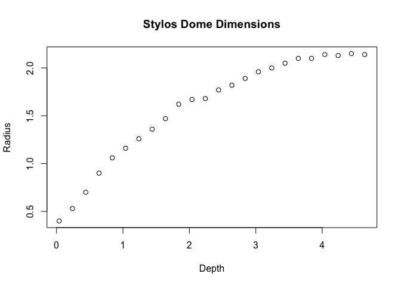
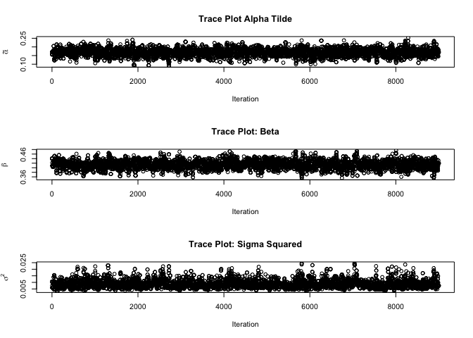
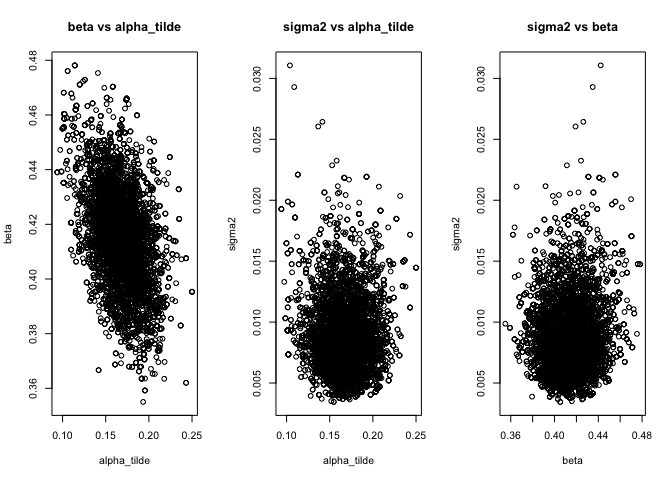
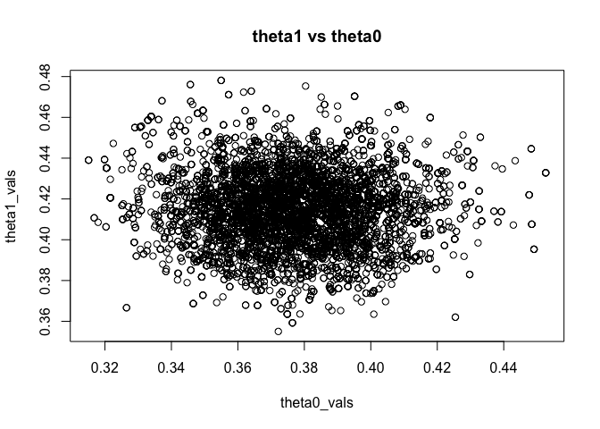
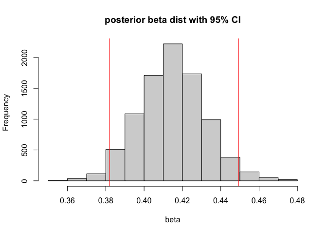
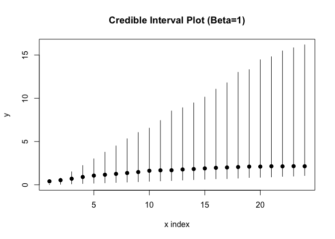

Metropolis Hastings
================

## Introduction

This study examines the mathematical modeling of **corbelling**, a
prehistoric roofing technique. We analyze 24 measurements from the late
Minoan tholos dome at Stylos, Crete, to understand the structural
relationship between dome depth ($x$) and radius ($y$).

The underlying physical model is a power law $y_i = \alpha x_i^\beta$,
which we analyze via the log-linear transformation:
$$\ln y_i = \ln \alpha + \beta \ln x_i + \epsilon_i, \quad \epsilon_i \sim N(0, \sigma^2)$$

## Data Setup

``` r
knitr::opts_chunk$set(fig.path = "images/MH2/", warning = FALSE, message = FALSE)
library(MASS)
df <- read.csv("data/stylos.csv")
head(df)
```

    ##      x    y
    ## 1 0.04 0.40
    ## 2 0.24 0.53
    ## 3 0.44 0.70
    ## 4 0.64 0.90
    ## 5 0.84 1.06
    ## 6 1.04 1.16

#### EDA

The raw data shows a clear non-linear curve, suggesting that a simple
linear model in the raw scale would be inappropriate

``` r
plot(df$x, df$y,
     main = "Stylos Dome Dimensions",
     xlab = "Depth", ylab = "Radius")
```

<!-- -->

#### Bayesian Analysis

Use a adopt a Bayesian framework to estimate the parameters of the
dome’s geometry ($\tilde{\alpha}, \beta, \sigma^2$)

The problem is formulated as follows:Likelihood: We assume the errors in
the log-linear model follow a normal distribution, implying a log-normal
likelihood for the radius $y$.

Priors: An improper uniform prior for the coefficients:
$\pi(\tilde{\alpha}, \beta)$ proportional to 1. A Jeffreys prior for the
variance: $\pi(\sigma^2) \propto 1/\sigma^2$, which is invariant to
scale transformations.

To sample parameters, a Metropolis Hastings Sampler is used.

#### Metropolis Hastings Sampler

``` r
sampler <- function(x, y) {
  n <- length(y)
  xmean <- mean(log(x))

  # Initial guesses via linear model
  fit <- lm(log(y) ~ log(x))
  alpha_tilde <- unname(coef(fit)[1])
  beta <- unname(coef(fit)[2])
  sigma2 <- (summary(fit)$sigma)^2

  # Reparameterisation
  theta0 <- alpha_tilde + beta * xmean
  theta1 <- beta
  phi <- log(sigma2)
  mu <- c(theta0, theta1, phi)

  # Proposal covariance
  theta0_sig <- unname(summary(fit)$coefficients[, "Std. Error"])[1]^2
  theta1_sig <- unname(summary(fit)$coefficients[, "Std. Error"])[2]^2
  tau_sig <- 2/n
  covar <- diag(c(theta0_sig, theta1_sig, tau_sig))

  posterior <- function(mu) {
    theta0 <- mu[1]
    theta1 <- mu[2]
    tau <- mu[3]

    a1 <- sum((log(y) - theta0 - theta1 * (log(x) - xmean))^2)
    a2 <- exp(-1/(2 * exp(tau)) * a1)
    a3 <- 1/(exp(tau)^(n/2 + 1)) * a2 * exp(tau)
    return(a3)
  }

  T <- 10000
  samples <- matrix(NA, nrow = T, ncol = 3)
  samples[1, ] <- mu
  tune <- 2.38^2/3

  for (i in 2:T) {
    sample <- mvrnorm(1, mu, covar * tune)

    if (posterior(mu) == 0) {
      ratio <- 1
    } else {
      ratio <- posterior(sample)/posterior(mu)
    }

    if (runif(1) < ratio) {
      samples[i, ] <- sample
      mu <- sample
    } else {
      samples[i, ] <- samples[i-1, ]
    }
  }

  # Post-processing
  burn_in <- 1000
  samples <- samples[(burn_in + 1):T, ]

  samples[, 1] <- samples[, 1] - samples[, 2] * xmean
  samples[, 3] <- exp(samples[, 3])

  return(samples)
}
```

#### Trace Plots

``` r
par(mfrow=c(3,1))
results <- sampler(df$x, df$y)

plot(results[,1],
     main="Trace Plot Alpha Tilde",
     ylab=expression(tilde(alpha)), xlab="Iteration")

plot(results[,2],
     main="Trace Plot: Beta",
     ylab=expression(beta), xlab="Iteration")

plot(results[,3],
     main="Trace Plot: Sigma Squared",
     ylab=expression(sigma^2), xlab="Iteration")
```

<!-- -->

#### Univariate Posterior Marginals

``` r
par(mfrow=c(1,3))


hist(results[,1], breaks=30, prob=TRUE,
     main=expression(paste(tilde(alpha), " dist")),
     xlab=expression(tilde(alpha)))
lines(density(results[,1]), col="red", lwd=2)

# Beta Distribution
hist(results[,2], breaks=30, prob=TRUE,
     main=expression(paste(beta, " dist")),
     xlab=expression(beta))
lines(density(results[,2]), col="red", lwd=2)

# Sigma Squared Distribution
hist(results[,3], breaks=30, prob=TRUE,
     main=expression(paste(sigma^2, " dist")),
     xlab=expression(sigma^2))
lines(density(results[,3]), col="red", lwd=2)
```

<!-- -->

#### Bivariate Posterior Marginals

``` r
results <- sampler(df$x, df$y)

# Bivariate Posterior Marginals
par(mfrow=c(1,3))
plot(results[,1], results[,2], xlab="alpha_tilde", ylab="beta", main="beta vs alpha_tilde")
plot(results[,1], results[,3], xlab="alpha_tilde", ylab="sigma2", main="sigma2 vs alpha_tilde")
plot(results[,2], results[,3], xlab="beta", ylab="sigma2", main="sigma2 vs beta")
```

<!-- -->

#### Parametrisation Check

can see theta1 and theta0 very uncorrelated

``` r
x_mean_val <- mean(log(df$x))
theta0_vals <- results[,1] + results[,2] * x_mean_val
theta1_vals <- results[,2]

par(mfrow=c(1,1))
plot(theta0_vals, theta1_vals, main="theta1 vs theta0")
```

<!-- -->

#### Predictive Distributions

Using LOOCV method

``` r
cilower <- c()
ciupper <- c()
y_pred_all <- list()

for (k in 1:length(df$x)) {
  # Leave one out
  x <- df$x[-k]
  y <- df$y[-k]

  result <- sampler(x, y)

  alpha_tilde <- result[, 1]
  beta <- result[, 2]
  sigma2 <- result[, 3]

  # Predict missing point
  mu_pred <- alpha_tilde + beta * log(df$x[k])
  samples <- rnorm(length(mu_pred), mean = mu_pred, sd = sqrt(sigma2))
  y_pred <- exp(samples)
  y_pred_all[[k]] <- y_pred

  # Store CI
  ci <- quantile(y_pred, c(0.025, 0.975))
  cilower <- c(cilower, ci[1])
  ciupper <- c(ciupper, ci[2])
}
par(mfrow=c(2,1))
hist(y_pred_all[[1]], main="Histogram of y_pred", xlab="y_pred")
abline(v=df$y[1], col="blue", lwd=2, lty=2)
abline(v=quantile(y_pred_all[[1]], c(0.025, 0.975)), col="red", lty=2)

plot(1:length(df$x), df$y, ylim=range(c(cilower, ciupper)), pch=19, main="Credible Interval Plot", xlab="x index", ylab="y")
segments(1:length(df$x), cilower, 1:length(df$x), ciupper)
```

<!-- -->

#### Model Simplification

Testing the simplification that beta=1

``` r
# Figure 9: Posterior Marginal for Beta
hist(results[, 2], main="posterior beta dist with 95% CI", xlab="beta")
abline(v=quantile(results[, 2], c(0.025, 0.975)), col="red")
abline(v=1, col="red")
```

<!-- -->

``` r
# Fixed Sampler for Beta = 1
sampler_fixed <- function(x, y) {
  n <- length(y)
  fit <- lm(log(y) ~ offset(1 * log(x)))
  alpha_tilde <- unname(coef(fit)[1])
  sigma2 <- (summary(fit)$sigma)^2

  theta0 <- alpha_tilde
  phi <- log(sigma2)
  mu <- c(theta0, phi)

  theta0_sig <- unname(summary(fit)$coefficients[, "Std. Error"])[1]^2
  tau_sig <- 2/n
  covar <- diag(c(theta0_sig, tau_sig))

  posterior <- function(mu) {
    theta0 <- mu[1]
    tau <- mu[2]

    a1 <- sum((log(y) - theta0 - 1 * log(x))^2)
    a2 <- exp(-1/(2 * exp(tau)) * a1)
    a3 <- 1/(exp(tau)^(n/2 + 1)) * a2 * exp(tau)
    return(a3)
  }

  T <- 10000
  samples <- matrix(NA, nrow = T, ncol = 2)
  samples[1, ] <- mu
  tune <- 2.38^2/2

  for (i in 2:T) {
    sample <- mvrnorm(1, mu, covar * tune)
    if (posterior(mu) == 0) { ratio <- 1 } else { ratio <- posterior(sample)/posterior(mu) }

    if (runif(1) < ratio) {
      samples[i, ] <- sample
      mu <- sample
    } else {
      samples[i, ] <- samples[i-1, ]
    }
  }

  burn_in <- 1000
  samples <- samples[(burn_in + 1):T, ]
  samples[, 2] <- exp(samples[, 2])
  return(samples)
}
```

#### Final Comparison

``` r
cilower_fixed <- c()
ciupper_fixed <- c()

for (k in 1:length(df$x)) {
  x <- df$x[-k]
  y <- df$y[-k]

  result <- sampler_fixed(x, y)

  alpha_tilde <- result[, 1]
  sigma2 <- result[, 2]

  mu_pred <- alpha_tilde + 1 * log(df$x[k])
  samples <- rnorm(length(mu_pred), mean = mu_pred, sd = sqrt(sigma2))
  y_pred <- exp(samples)

  ci <- quantile(y_pred, c(0.025, 0.975))
  cilower_fixed <- c(cilower_fixed, ci[1])
  ciupper_fixed <- c(ciupper_fixed, ci[2])
}

plot(1:length(df$x), df$y, ylim=range(c(cilower_fixed, ciupper_fixed)), pch=19, main="Credible Interval Plot (Beta=1)", xlab="x index", ylab="y")
segments(1:length(df$x), cilower_fixed, 1:length(df$x), ciupper_fixed)
```

<!-- -->

Beta = 1 seems very unlikely, systematic trend of sitting on lower
boundary of credible interval plot
