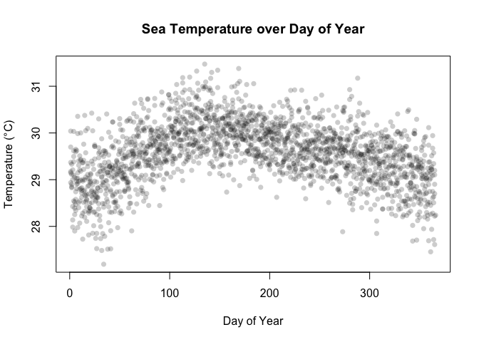
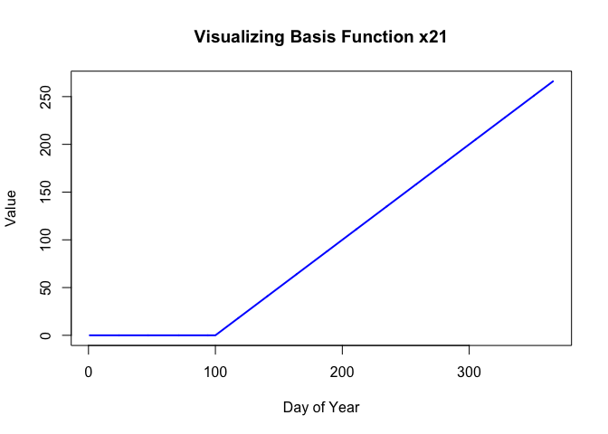
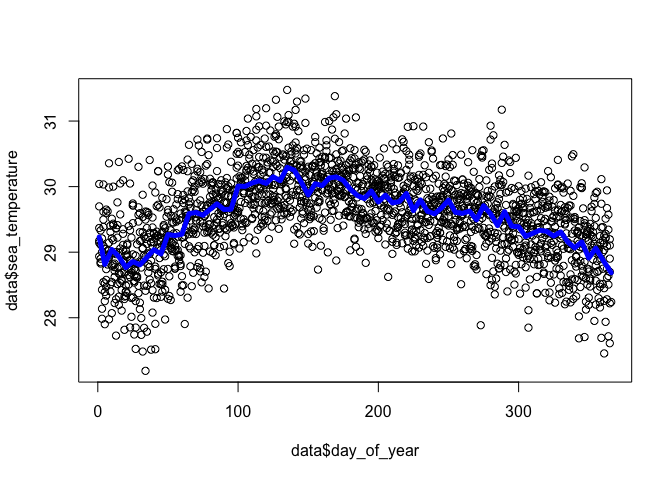
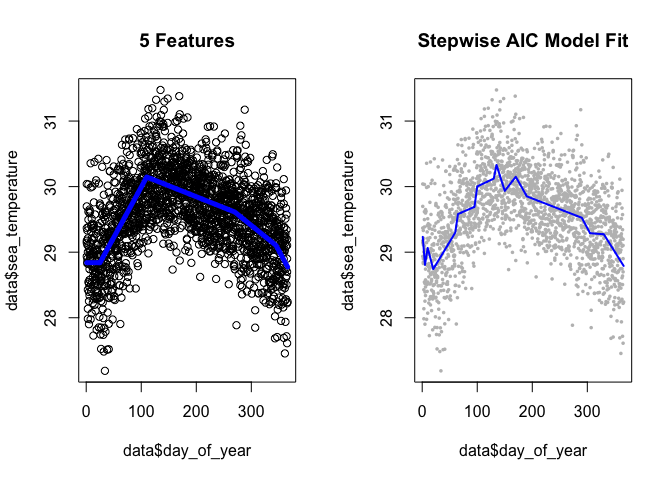
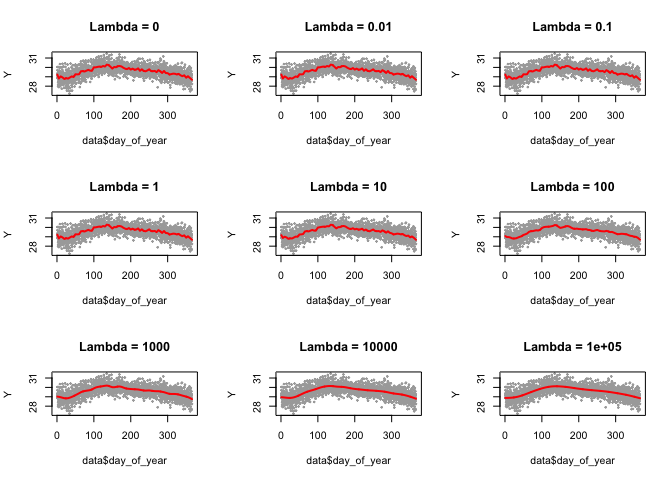
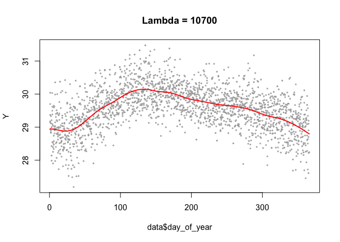

Non Linear Modelling
================

#### Introduction

Analysis of non - linear modelling using basis functions, as well as
(ridge) regularisation

#### Setup

``` r
knitr::opts_chunk$set(fig.path = "images/NLE/", warning = FALSE, message = FALSE)
data <- read.csv("data/Malacca_strait_data.csv", header = TRUE)
data <- data[order(data$day_of_year), ]
head(data)
```

    ##      day_of_year sea_temperature
    ## 1              1        29.36857
    ## 314            1        29.69857
    ## 575            1        29.14429
    ## 888            1        29.17429
    ## 1462           1        28.93571
    ## 1775           1        30.04000

#### Data Visualisation

``` r
plot(data$day_of_year, data$sea_temperature,
     pch = 16, col = rgb(0, 0, 0, 0.2),
     main = "Sea Temperature over Day of Year",
     xlab = "Day of Year", ylab = "Temperature (°C)")
```

<!-- -->

Model has non linearity. Potential solutions include a polynomial
regression (though can suffer from erratic behaviour at boundaries), or
non - linear modelling. Non Linear Modelling with basis functions will
be explored here.

#### Creating Basis Functions

``` r
# Create basis function dataframe
data.2 <- data.frame(sea_temperature = data$sea_temperature)
for(i in 1:73){
  x <- data$day_of_year - (i - 1) * 5
  x[x < 0] <- 0
  data.2[, paste("x", i, sep = "")] <- x
}

plot(data$day_of_year, data.2$x21, type = "l", col = "blue", lwd = 2,
     main = "Visualizing Basis Function x21", xlab = "Day of Year", ylab = "Value")
```

<!-- -->

#### Fitting full model

``` r
lm.2<-lm(sea_temperature ~.,data=data.2)
plot(data$day_of_year,data$sea_temperature)
lines(data$day_of_year,lm.2$fit,col="blue",lwd=5)
```

<!-- -->

very noisy, model has likely overfitted.

#### Model Selection

Exploring some ways to reduce noise with model selection. Comparing
‘eyeballing’ basis steps to stepwise AIC

``` r
library(MASS)

lm.3 <- lm(sea_temperature ~ x6 + x23 + x55 + x70, data = data.2)
lm.full <- lm(sea_temperature ~ ., data = data.2)
lm.4 <- stepAIC(lm.full, trace = FALSE, direction = "both")

par(mfrow=c(1,2))

plot(data$day_of_year,data$sea_temperature, main='5 Features')
lines(data$day_of_year,lm.3$fit,col="blue",lwd=5)

plot(data$day_of_year, data$sea_temperature, col = "gray", pch = 16, cex = 0.5,
     main = "Stepwise AIC Model Fit")
lines(data$day_of_year, lm.4$fitted.values, col = "blue", lwd = 2)
```

<!-- -->

#### Ridge Regression

An alternate shrinkage method, shrink coefficients by adding a penalty,
lambda. Manual calculation below

``` r
X <- as.matrix(cbind(1, data.2[, -1]))
Y <- data$sea_temperature
D <- diag(c(0, rep(1, 73))) # Penalty matrix (identity, but 0 for intercept)

par(mfrow = c(3, 3))
lambdas <- c(0, 0.01, 0.1, 1, 10, 100, 1000, 10000, 100000)

for (l in lambdas) {
  # Ridge Formula: beta_star = (X'X + lambda*D)^-1 * X'Y
  bstar = solve(t(X) %*% X + l * D) %*% t(X) %*% Y
  fitted_vals = X %*% bstar

  plot(data$day_of_year, Y, main = paste("Lambda =", l), cex = 0.3, col = "darkgrey")
  lines(data$day_of_year, fitted_vals, col = "red", lwd = 2)
}
```

<!-- -->

#### Finding the best lambda

Optimising the PRESS (which simulates LOOCV).

``` r
# Example - evaluating range of lambda values to show the effect of changing lambda
for (l in c(1, 10, 100, 1000, 5000, 10000)) {
  PRESS <- 0
  for(i in 1:length(Y)){
    Y.i <- Y[-i]
    X.i <- X[-i, ]
    beta.i <- solve(t(X.i) %*% X.i + l * D) %*% t(X.i) %*% Y.i
    PRESS <- PRESS + (Y[i] - X[i, ] %*% beta.i)^2
  }
  cat("Lambda:", l, "| PRESS:", PRESS, "\n")
}
```

    ## Lambda: 1 | PRESS: 528.4466 
    ## Lambda: 10 | PRESS: 524.0983 
    ## Lambda: 100 | PRESS: 515.2806 
    ## Lambda: 1000 | PRESS: 509.2414 
    ## Lambda: 5000 | PRESS: 507.6077 
    ## Lambda: 10000 | PRESS: 507.4296

#### Optimal Ridge Lambda

``` r
l = 10700
bstar = solve(t(X) %*% X + l * D) %*% t(X) %*% Y
fitted_vals = X %*% bstar

plot(data$day_of_year, Y, main = paste("Lambda =", l), cex = 0.3, col = "darkgrey")
lines(data$day_of_year, fitted_vals, col = "red", lwd = 2)
```

<!-- -->
